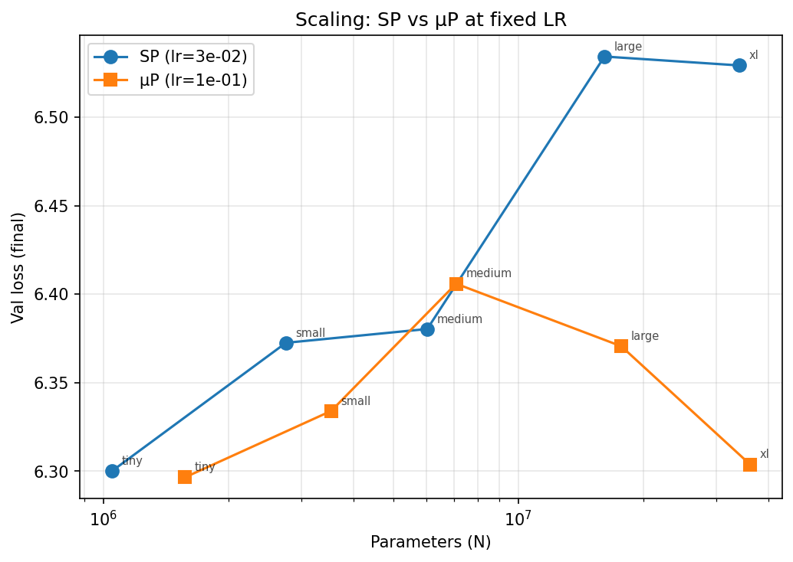

# SVG Scaling Laws

This project studies transformer scale, standard parameterization, and maximal-update parameterization (muP) for SVG source generation.

I built and ran it independently as an optional project for NYU's CS-GY 6923 Machine Learning course. It is a course project, not a peer-reviewed publication.

## Read the report

[Open the report notebook](report/report.ipynb) for the full write-up, experiment results, figures, and discussion of limitations. The notebook includes saved outputs, so you can read it without rerunning the experiments.

An [HTML version of the report](report/report.html) is also available to download and open in a browser.

## Research question

Does increasing the size of a decoder-only transformer improve SVG generation under a fixed training setup, and does muP transfer optimization settings across model sizes more reliably than standard parameterization?

## What I built

- A cleaning and tokenization pipeline for approximately 580,000 SVG files from three public datasets.
- File-level 98/1/1 train-validation-test splits covering roughly 68 million tokens.
- A 4,096-token byte-pair encoding vocabulary trained on a 100,000-file subset.
- Standard-parameterization and muP decoder-only transformers from approximately 1M to 36M parameters.
- Configuration-driven training, proxy learning-rate sweeps, a muP coordinate check, evaluation, bootstrap analysis, sample generation, and rendering audits.
- Ten primary scaling runs completed on a single RTX 3060 laptop GPU in approximately 14 GPU-hours.

## Main findings

| Parameterization | Smallest model validation loss | Largest model validation loss |
| --- | ---: | ---: |
| Standard | 6.300 | 6.529 |
| muP | 6.297 | 6.304 |

At approximately 36M parameters, muP finished 0.23 nats below the standard-parameterization model and within 0.01 nats of the smallest muP model. This supports a narrow conclusion: muP made optimization transfer more stable at the largest scale tested in this setup.

The broader scaling result is inconclusive. Bootstrap confidence intervals for the fitted exponent cross zero, and the experiment includes too few model scales and random seeds for a strong power-law claim.

A 36M muP run had test perplexity near 481. Longer-run models reached values near 24, but render validity remained at or below 20% across these evaluations. My main takeaway was that better next-token prediction did not reliably produce valid SVG structure.



## Method summary

- Decoder-only transformer language models over serialized SVG text.
- Matched effective batch size of 524,288 tokens per optimizer step.
- BF16 training with the same token-budget logic across model sizes.
- Learning-rate sweep on the smallest model followed by fixed learning-rate transfer.
- muP coordinate check before the main comparison.
- Evaluation with held-out loss/perplexity, XML parsing, structural checks, renderer success, and visual sample inspection.

## Reproduce the pipeline

Create the environment and review the configuration files before launching a run. The full orchestration entry point is:

```bash
python scripts/15_full_pipeline.py
```

The full campaign was designed for constrained local compute. Paths, data sources, and hardware-dependent settings may need to be adjusted before rerunning.

## Repository map

- `configs/` - data, model, and experiment configurations
- `scripts/` - preprocessing, training, evaluation, rendering, and orchestration
- `src/` - model and pipeline implementation
- [Report notebook](report/report.ipynb) - analysis and technical report source
- [HTML report](report/report.html) - rendered report
- `report/figures/` - plots, tables, and generated-sample audits

## Limitations

- One primary seed per scale is not sufficient to characterize training variance.
- The tested range, approximately 1M-36M parameters, is small for estimating a robust scaling law.
- XML and renderer validity do not measure semantic quality or faithfulness to an intended image.
- Tokenization and unconstrained decoding make global SVG grammar difficult to learn.
- Results should be interpreted as evidence from this training setup, not as a general claim about muP or vector-graphics generation.

## Suggested next experiments

1. Repeat each scale across multiple random seeds.
2. Separate syntax, renderability, and semantic similarity in the evaluation.
3. Compare grammar-constrained decoding with unconstrained sampling.
4. Test tokenizations that preserve SVG structure and numeric coordinates.
5. Extend the scale and compute range before fitting a power law.

## Author

Toan Vu - https://github.com/xdpikaboo
